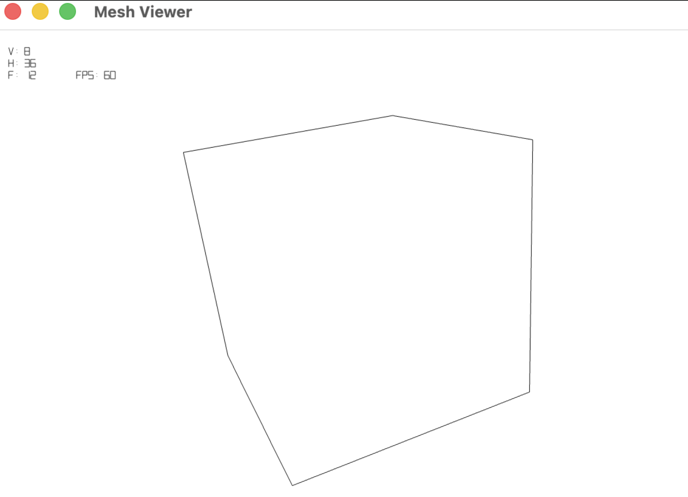
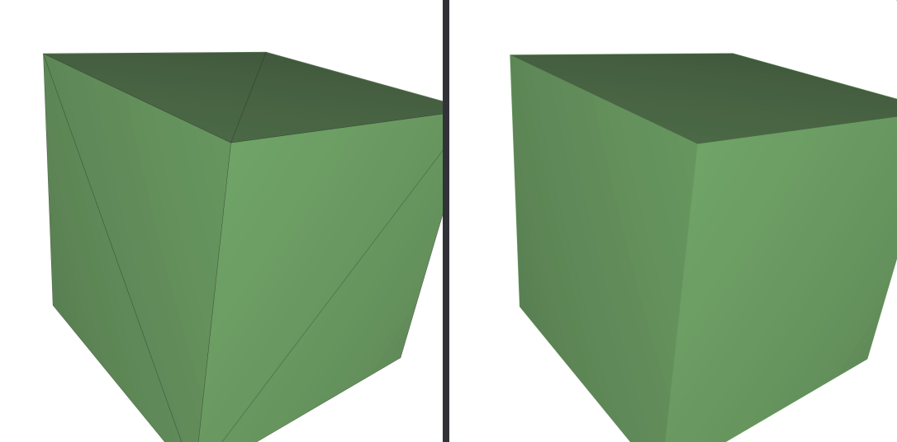
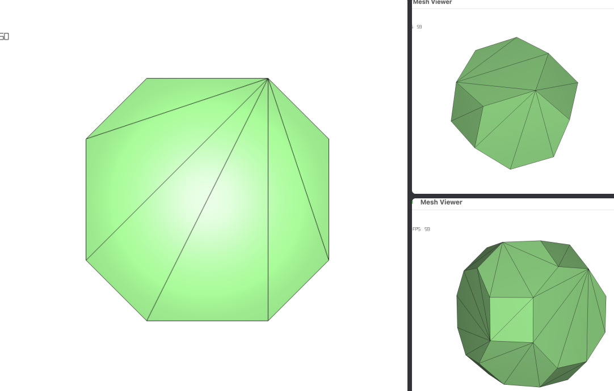
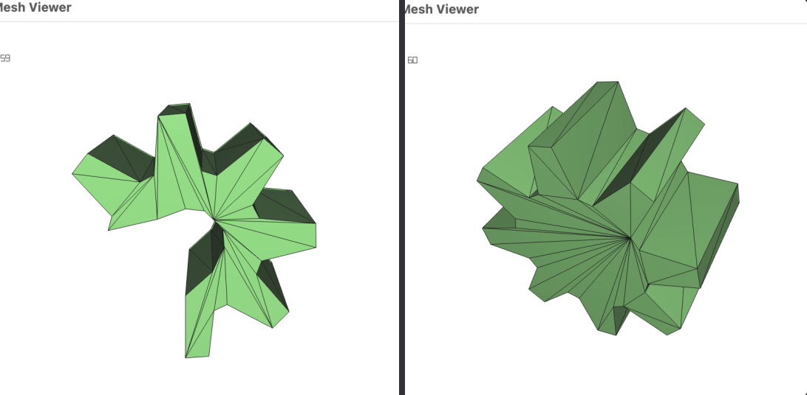
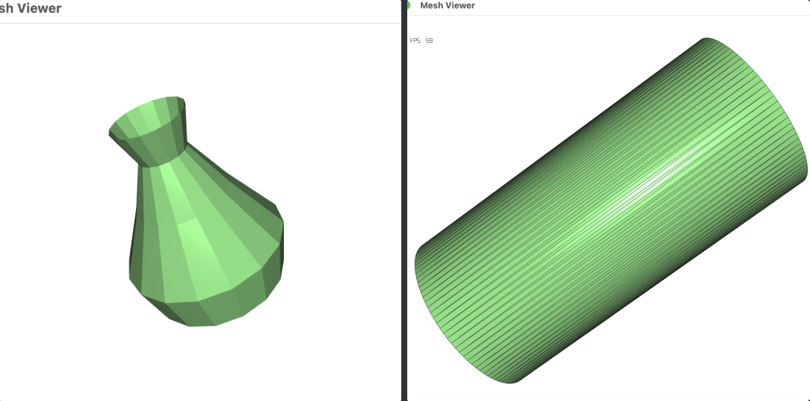
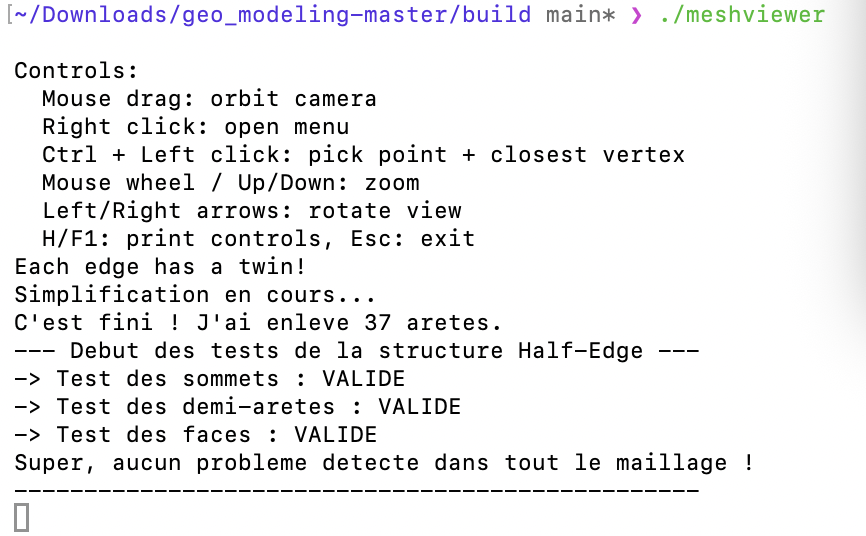
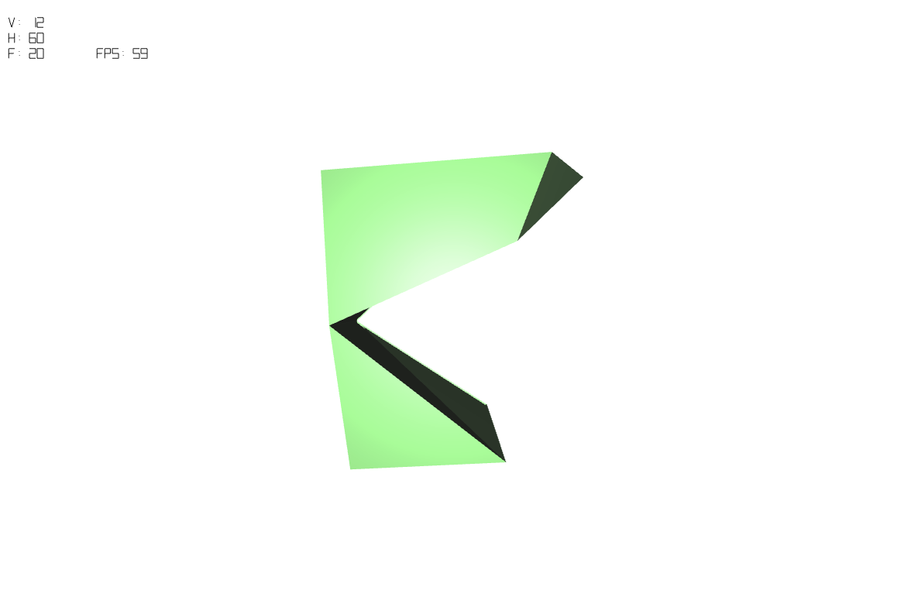
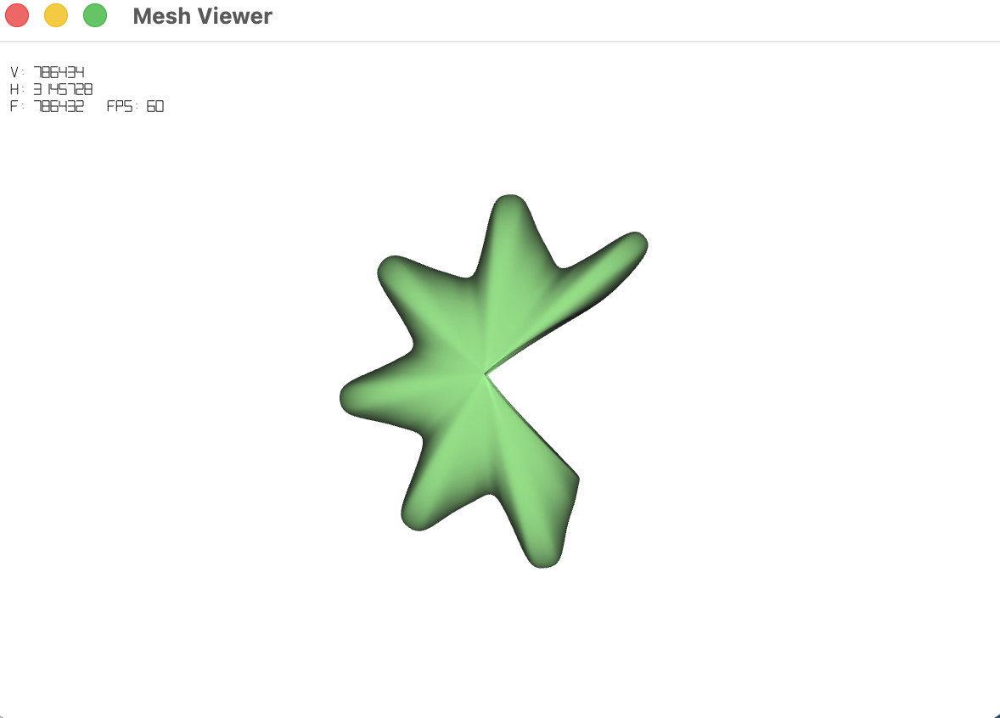

# Mesh Viewer (OpenGL 3.3 + SDL2)

Cross-platform CMake build (Windows, Linux, macOS) with modern OpenGL rendering/picking and SDL2 window/input layer.

## Build Requirements

- CMake 3.20+
- C++17 compiler
- OpenGL
- Git (for `FetchContent` dependencies)
- Internet access during first configure

## Build

Same commands on Windows, Linux, and macOS:

```bash
cmake -S . -B build -DCMAKE_BUILD_TYPE=Release
cmake --build build --config Release --parallel
```

The executable is named `meshviewer`.

---

## 🎯 Exercices et Méthodes implémentées

Ce projet inclut l'implémentation de plusieurs algorithmes de traitement géométrique sur une structure **Half-Edge**.

### 1. Calcul des normales
Pour que la lumière s'affiche correctement sur les objets, il fallait calculer les normales.
* **Normale des faces :** Pour une face, j'ai pris les deux premières arêtes (vecteurs `v1` et `v2`), et j'ai fait un produit vectoriel (`v1 x v2`) puis je l'ai normalisé.
* **Normale des sommets (Smooth Shading) :** Pour lisser l'affichage, la normale d'un sommet est la moyenne des normales de toutes les faces qui le touchent. Pour parcourir toutes les faces autour du sommet, j'ai utilisé une boucle avec les pointeurs Half-Edge : `h = h->prev->twin`.

### 2. Détection de la Silhouette
Pour dessiner le contour de l'objet, je parcours toutes les arêtes. 
* Pour chaque arête, je regarde les normales des deux faces qui la partagent.
* Je calcule leur produit scalaire par rapport à la direction de la caméra. Si une face "regarde" la caméra (produit scalaire positif) et l'autre lui "tourne le dos" (produit scalaire négatif), c'est qu'on est sur le bord de l'objet. 
* La condition est donc : `dot1 * dot2 <= 0.0`.



### 3. Triangulation (Méthode de Ear Clipping)
Pour transformer n'importe quelle face en triangles (même les faces concaves), j'ai codé la méthode des "Ear Clipping".
1. Je calcule la vraie normale de la face avec la méthode de Newell.
2. Je regarde chaque triplet de 3 sommets consécutifs. Pour qu'il forme une "oreille" qu'on peut couper, il faut :
   * Que l'angle soit convexe (via produit vectoriel : `(u x v) * normal > 0`).
   * Qu'aucun autre sommet de la face ne se trouve à l'intérieur de ce triangle.
3. Si c'est bien une oreille, je crée une nouvelle arête diagonale pour fermer le triangle, et je le détache du reste de la face.

**Après triangulation :**






### 4. Surface de Révolution (Génération du vase)
Fonction pour générer une forme 3D en faisant tourner un profil 2D autour de l'axe Y.
* Je calcule la position des nouveaux points avec des fonctions trigonométriques selon l'angle de rotation.
* Je relie les points générés pour créer des faces à 4 côtés (Quads). Pour que le maillage soit solide, je lie les arêtes jumelles (twins) entre elles en utilisant un dictionnaire `std::map` basé sur l'ID des deux sommets de chaque arête.



### 5. Vérification du maillage (`verifyMesh`)
Pour certifier que les algorithmes ne cassent pas le maillage, une fonction de diagnostic boucle sur tout l'objet et vérifie :
* Que l'arête sortante d'un sommet part bien de ce sommet (`originof->source == v`).
* Que les jumeaux se pointent bien mutuellement (`twin->twin == h`).
* Que les boucles sont fermées (`next->prev == h` et `prev->next == h`).
* *Note : La fonction tolère les arêtes sans twin si on est sur un bord ouvert (comme le trou du vase), mais affiche quand même un "Warning" dans la console pour nous avertir d'un éventuel trou involontaire.*



### 6. Simplification (Shortest Edge Collapse)
Pour réduire le nombre de triangles, j'écrase les arêtes les plus courtes (10% par clic).
* **Choix :** Recherche de l'arête avec la plus petite distance au carré (`dx*dx + dy*dy + dz*dz`).
* **Écrasement :** 
  1. Je déplace le 1er sommet au milieu de l'arête.
  2. Toutes les arêtes pointant sur le 2ème sommet pointent désormais sur le 1er.
  3. Je supprime les deux triangles liés à l'arête en reliant les bords extérieurs entre eux (`e1->twin->twin = e2->twin`).
  4. L'algorithme force la triangulation avant l'exécution pour ne pas casser les Quads.

**Avant Simplification :**



### 7. Subdivision de Catmull-Clark
Pour lisser l'objet, j'ai implémenté la subdivision de Catmull-Clark :
* Je calcule le **Point de face** : moyenne des positions des sommets de la face.
* Je calcule le **Point d'arête** : moyenne des 2 sommets de l'arête + les 2 points des faces adjacentes.
* Je déplace les **anciens sommets** avec la formule : `V_nouveau = (F + 2R + (n-3)*V_ancien) / n`.
* **Construction :** L'ancien maillage est vidé (`clear()`) et reconstruit avec de nouveaux Quads à partir des points calculés. Cela évite les erreurs critiques de topologie Half-Edge.

**Résultat après lissage Catmull-Clark :**

